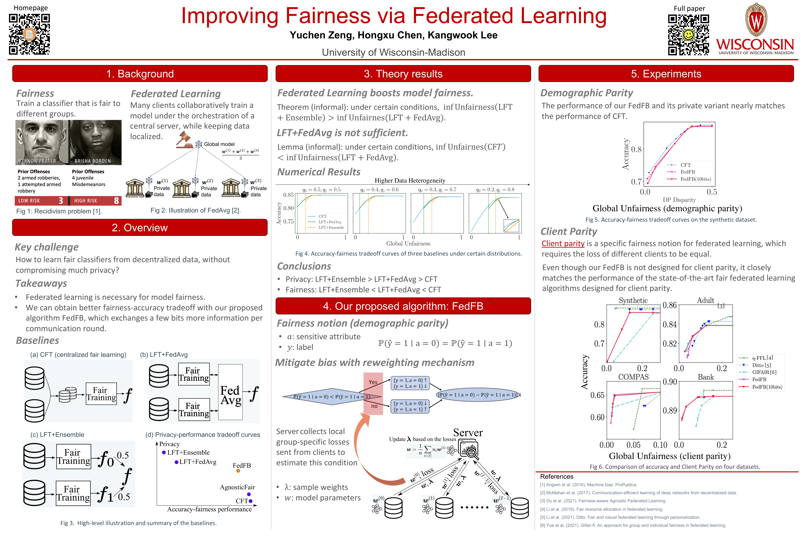

# Improving Fairness via Federated Learning

[Yuchen Zeng](https://yzeng58.github.io/zyc_cv/), [Hongxu Chen](https://sites.google.com/view/hongxuchen/home), [Kangwook Lee](https://kangwooklee.com/)

University of Wisconsin-Madison, USA. 

Links: [Paper](https://arxiv.org/pdf/2110.15545.pdf).



## Abstract

Recently, lots of algorithms have been proposed for learning a fair classifier from decentralized data. However, many theoretical and algorithmic questions remain open. First, is federated learning necessary, i.e., can we simply train locally fair classifiers and aggregate them? In this work, we first propose a new theoretical framework, with which we demonstrate that federated learning can strictly boost model fairness compared with such non-federated algorithms. We then theoretically and empirically show that the performance tradeoff of FedAvg-based fair learning algorithms is strictly worse than that of a fair classifier trained on centralized data. To bridge this gap, we propose FedFB, a private fair learning algorithm on decentralized data. The key idea is to modify the FedAvg protocol so that it can effectively mimic the centralized fair learning. Our experimental results show that FedFB significantly outperforms existing approaches, sometimes matching the performance of the centrally trained model.

## Running experiments

We have performed extensive experiment to evaluate our algorithm. Here, we introduce how to repeat the experiments. 

### Step 1: Loading necessary modules

```python
import sys, os
working_dir = '.'
sys.path.insert(1, os.path.join(working_dir, 'FedFB'))
os.environ["PYTHONPATH"] = os.path.join(working_dir, 'FedFB')

from DP_run import *
```

### Step 2: Running simulations 

Here we introduce two functions for running the simulations. 

#### Function `sim_dp` 

```python
sim_dp(method, model, dataset, num_sim = 5, seed = 0, resources_per_trial = {'cpu':4})
```

The first function evaluate the fair learning method given certain model architecture on a dataset. This function include hyperparameter tuning, and model evluation on multiple simuations. 

##### Parameters:

* `method`: String.

  Options:

  * `fedavg`: FedAvg;

  * `fedfb`: FedFB;

  * `cflfb`: CFT (Centralized Fair Training), implemented based on FairBatch[1];

  * `uflfb`: LFT+Ensemble (Local Fair Training + Ensemble), where the local fair training is implemented based on FairBatch[1];

  * `fflfb`: LFT+FedAvg (Local Fair Training + FedAvg), where the local fair training is implemented based on FairBatch[1];

* `model`: String. Options:`logisitc regression` and `multilayer perceptron`. Please see our paper for detailed model description. 

* `dataset`: String. Options: `synthetic`, `adult`, `bank`, `compas`. Please see our paper for detailed dataset description. 

* `num_sim`: Positive integer. Number of simulations, i.e., repeat the experiment `num_sim` times with different seeds. 

* `seed`: Positive integer. 

* `resources_per_trial`: Parameter that determines parallelism/GPUs for hyperparameter selection (4 CPUs per trial by default). This is the parameter introduced by hyperparameter tuning module`ray.tune`, please check more details in the documentation of `ray.tune` in https://docs.ray.io/en/latest/tune/api_docs/execution.html. 

##### Example:

```python
sim_dp('fedavg', 'logistic regression', 'synthetic')
```

#### Function `sim_dp_man` 

Sometimes we do not want to do the default hyperparameter selection but with some specific hyperparameters, then we can use the following function. 

```python
sim_dp_man(method, model, dataset, num_sim = 5, seed = 0, select_round = False, **kwargs)
```

##### Parameters: 

The parameters of `sim_dp_man` is almost the same as `sim_dp`, except that one can use`**kwargs`to specify the hyperparameters. For each method, there are different hyperparameters to choose. Unless otherwise stated, here are the description of the common hyperparameters.

* `num_rounds`: Positive integer. Number of communication rounds.

* `local_epochs`: Positive integer. Number of local epochs between communication rounds.

* `learning_rate`: Numeric. Learning rate of the model parameters. 

* `optimizer`: Two options: `adam` and `sgd`.

* `alpha`: Numeric. Step size of updating $\lambda$ in FairBatch.

Here we provide the tunable hyperparameters for different methods. 

* `**kwargs`:

  * FedAvg: `num_rounds`, `local_epochs`, `learning_rate`, `optimizer`

  * FedFB: `num_rounds`, `local_epochs`, `learning_rate`, `optimizer`, `alpha`, `bits`
    *  `bits`: Integer. Default `False` or `0`. If positive integer is received, then FedFB is restricted to only exchange `bits` bits of information per communication round. 
  * CFT: `outer_rounds`, `inner_rounds`, `learning_rate`,`optimizer`, `alpha`
    * `outer_rounds`: Positive integer. Hyperparameter of FairBatch[1], the number of rounds for updating $\lambda$. 
    * `inner_rounds`: Positibe integer. Hyperparameter of FairBatch[1], the number of rounds for learning a model given $\lambda$. 
  * LFT+Ensemble: `num_epochs`, `learning_rate`, `alpha`, `optimizer``
    * ``num_epochs`: Positive integer. Hyperparameter of FairBatch[1], the number of epochs for updating model parameters. 
  * LFT+FedAvg: `num_rounds`, `local_epochs`, `learning_rate`, `optimizer`, `alpha`
    * `learning_rate`: 1D array. The length of the array depends on how many clients the dataset has. This specifies the learning rate of model parameters for each client. 
    * `alpha`: 1D array. The length of the array depends on how many clients the dataset has. This specifies the step size for updating the $\lambda$ in FaitBatch[1] of each client. 

##### Example:

```python
sim_dp_man(
  'fflfb', 
  'multilayer perceptron', 
  'synthetic', 
  alpha = (0.05,0.04,0.03), 
  num_rounds = 2
)
```

## References 

[1] FairBatch: Batch Selection for Model Fairness. Y. Roh, K. Lee, S. Whang, and C. Suh. *ICLR 2021*.
